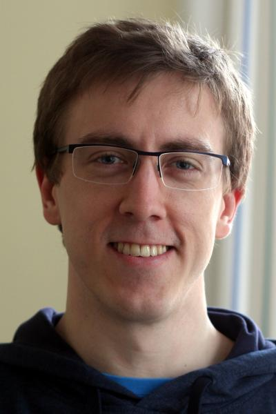

### About me
{: style="
  float: right;
  border: 1px solid #ccc;
  border-radius: 6px;
  box-shadow: 0 2px 6px rgba(0,0,0,0.15);
  margin: 0 0 1em 1em;
"}
I am tenured Research Associate (Docent) at the Jozef Stefan Institute in Ljubljana, Slovenia. Before that I was a postdoc at Stockholm University (Computational Mathematics) and a Ph.D. candidate at Uppsala University (Scientific Computing) in Sweden. I completed master studies at Technical University Munich (Computational Science) in Germany.

My research focuses on numerical methods for partial differential equations. 
By bridging numerical and functional analysis, I aim to improve:

- the stability of finite elements, kernel-based methods, and neural networks.

My mathematical work is motivated by advanced multiphysics problems that carry significant societal relevance in:

- climate, biomedical, and energy applications.

See page [Research]({{ site.baseurl }}/research/) for more specific research interests of mine and a list of publications.

### News
2025-12-24: Received qualification "Docent in Mathematics" from Faculty of Mathematics and Physics at University of Ljubljana.

2025-12-23: Received funding (as project leader) for project "Stabilizing multiphysics simulations for cost-effective and reliable metal processing" in collaboration with Faculty of Mechanical Engineering, University of Ljubljana.

2025-11-26: Held an invited talk at conference "Multiphysics and mixed-dimensional modeling and discretizations" at Simula Research Lab in Oslo.

2025-08-04: Started working at Jozef Stefan Institute, Ljubljana, as tenured Research Associate.

